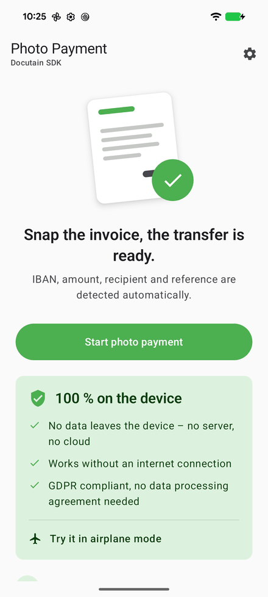
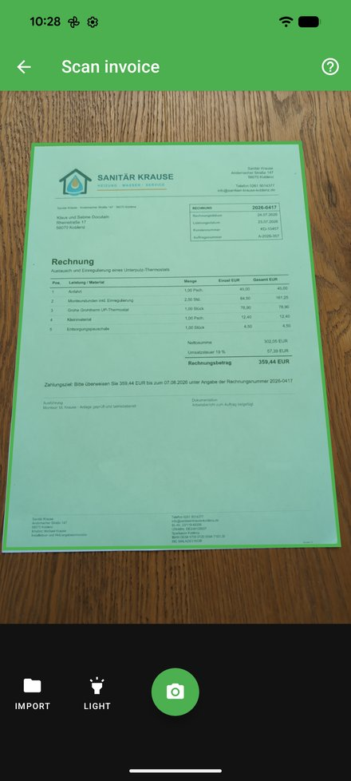
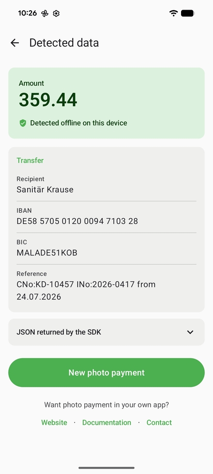

  

<h1 align="center">Photo Payment SDK Example for Kotlin Multiplatform</h1>

  Photo or PDF of an invoice in, bank transfer out: IBAN, BIC, amount, recipient and reference –
  detected <b>100&nbsp;% on the device</b>. Android and iOS from one Compose Multiplatform code base.

  <a href="https://docs.docutain.com/docs/kmp/photoPayment">Documentation</a> ·
  <a href="https://sdk.docutain.com/TrialLicense?Product=photo-payment">Free trial license</a> ·
  <a href="https://sdk.docutain.com">Website</a> ·
  <a href="https://sdk.docutain.com/#Contact">Contact</a>

  
  
  

## What it does

This sample app shows the **photo payment** of the [Docutain SDK](https://sdk.docutain.com):
the user takes a photo of an invoice, and the SDK returns everything a bank transfer needs.
It is the feature behind "pay by photo" in banking, accounting and invoice apps – known in
Germany as *Fotoüberweisung*.

- **Payment data from a photo** – recipient, IBAN, BIC, amount and reference
- **PDF invoices, too** – share a PDF or an image with the app, or open it with the app, from
  any other app such as mail, files or the browser
- **GiroCode / EPC QR code** – read straight from the code when the invoice has one
- **Multi-page invoices** – scanned in one go
- **SEPA creditor and payment state** – who actually receives the money, and whether the
  invoice is already paid, e.g. by direct debit
- **Ready-made scanner UI** – camera, automatic capture, cropping and page editing

## Privacy: 100 % on the device

The recognition runs entirely on the device. No image and no payment data is sent to a server,
it works without an internet connection – try it in airplane mode. That makes it
**GDPR compliant** without a data processing agreement.

## Getting started

1. Clone this repository and open it in Android Studio.
2. **Android:** run the `androidApp` configuration.
   **iOS:** on a Mac, run `pod install` in `iosApp`, then open `iosApp/iosApp.xcworkspace` in
   Xcode and run it. To run it on a device, first select your team in Xcode under
   *Signing & Capabilities* of the `iosApp` target.
3. That is all it takes to try the SDK out. The sample ships with a trial license key, valid
   until 1 December 2026.

To try the SDK in your own app, request a [free trial license key](https://sdk.docutain.com/TrialLicense?Product=photo-payment)
for its application id - one key covers Android and iOS - and pass it to `DocutainSdk.initSdk`,
as [`License.kt`](shared/src/commonMain/kotlin/de/docutain/sdk/docutain_sdk_example_photopayment_kmp_compose/payment/License.kt)
does. On iOS your app also needs:

- the native SDK as a pod, `pod 'DocutainSdk'` in the [`Podfile`](iosApp/Podfile)
- an `NSCameraUsageDescription` in the [`Info.plist`](iosApp/iosApp/Info.plist), the text iOS
  shows when the scanner asks for the camera

We currently also recommend `UIDesignRequiresCompatibility` in the `Info.plist`, which keeps the
design of iOS 18 on iOS 26 instead of Liquid Glass. It is optional.

## Where to look in the code

- [`PhotoPayment.kt`](shared/src/commonMain/kotlin/de/docutain/sdk/docutain_sdk_example_photopayment_kmp_compose/payment/PhotoPayment.kt)
  – configuring and starting the photo payment, with the camera or with files from other apps
- [`License.kt`](shared/src/commonMain/kotlin/de/docutain/sdk/docutain_sdk_example_photopayment_kmp_compose/payment/License.kt)
  – the license key and initializing the SDK with it
- [`PaymentData.kt`](shared/src/commonMain/kotlin/de/docutain/sdk/docutain_sdk_example_photopayment_kmp_compose/payment/PaymentData.kt)
  – reading the JSON the SDK returns into the fields of a transfer form

All options are described in the [documentation](https://docs.docutain.com/docs/kmp/photoPayment).

## Project structure

| Path | What it is |
|---|---|
| `shared/src/commonMain/kotlin/…/payment` | Starting the photo payment, the license key, parsing the result |
| `shared/src/commonMain/kotlin/…/ui` | The screens in Compose Multiplatform, shared by Android and iOS |
| `shared/src/commonMain/composeResources` | Texts in English and German, vector graphics |
| `androidApp` | The Android app: one activity showing the shared UI |
| `iosApp` | The iOS app: one SwiftUI view showing the shared UI |

## Requirements

- Android 7.0 (API 24) or newer, iOS 15 or newer
- Android Studio with the Kotlin Multiplatform plugin
- For iOS: a Mac with Xcode and [CocoaPods](https://cocoapods.org)

## What is the Docutain SDK?

The Docutain SDK brings automatic document scanning, text recognition (OCR), intelligent data
extraction, photo payment and PDF creation to your apps – for Android, iOS, Kotlin Multiplatform,
Flutter, React Native, .NET MAUI, Capacitor, Cordova and Windows. It works 100 % offline, which
ensures maximum data safety. Its modules can be licensed individually.

More at [sdk.docutain.com](https://sdk.docutain.com).

## License and support

The Docutain SDK is a commercial product and requires a paid license for production use.
Request a free trial license key at
[sdk.docutain.com/TrialLicense](https://sdk.docutain.com/TrialLicense?Product=photo-payment).

For questions and technical support, [contact us](https://sdk.docutain.com/#Contact) or write to
[support.sdk@Docutain.com](mailto:support.sdk@Docutain.com).
